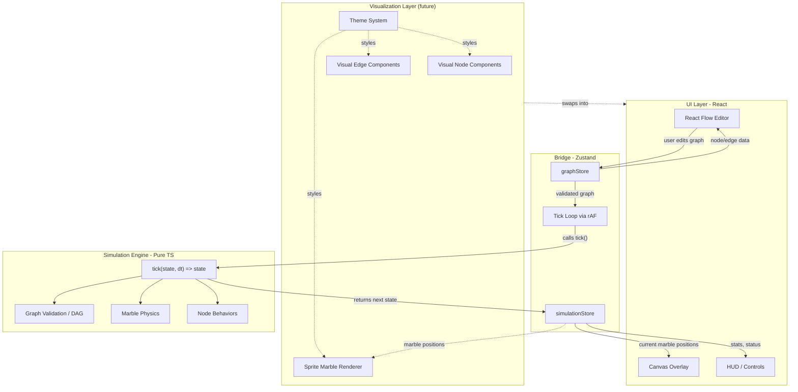

# Marble Machine Simulator — Architecture

> Web-based simulation environment where users construct marble runs using a visual node editor.
> The critical success factor is strict isolation between the graph construction (UI) and the simulation physics (Logic).

## Tech Stack

- **Runtime:** Vite + React 18+
- **Language:** TypeScript 5+ (Strict Mode)
- **State Management:** Zustand
- **Visuals:** React Flow (Nodes/Edges), Canvas API (Particles)
- **Validation:** Zod
- **Testing:** Vitest

---

## High-Level System Diagram



---

## Layer 1: Simulation Engine (`/src/simulation`)

This is the "brain." It is **pure TypeScript** — zero React, Zustand, or DOM imports. Every function is a pure transform: input in, output out, no side effects. Testable with Vitest in Node.js.

### Core Types — `types.ts`

Defines all data structures shared across the engine. Uses discriminated unions for node types and Zod schemas for validation at boundaries.

```typescript
// --- Core Identifiers ---
type NodeId = string;   // branded via Zod
type EdgeId = string;
type MarbleId = string;

// --- Simulation Node (NOT a React Flow node) ---
type SimNodeType = 'source' | 'sink' | 'splitter' | 'elevator' | 'ramp' | 'gate' | 'bucket';

interface SimNodeBase {
  id: NodeId;
  type: SimNodeType;
  position: { x: number; y: number };
}

interface SourceNode extends SimNodeBase {
  type: 'source';
  spawnRate: number;      // marbles per second
  spawnCooldown: number;  // ticks until next spawn
}

interface SplitterNode extends SimNodeBase {
  type: 'splitter';
  ratio: number;  // 0..1, probability of left output
}

interface GateNode extends SimNodeBase {
  type: 'gate';
  condition: GateCondition;  // what controls open/close
  isOpen: boolean;           // current state (mutated per tick)
  heldMarbles: MarbleId[];   // marbles waiting while gate is closed
}

type GateCondition =
  | { kind: 'marbleCount'; threshold: number }   // opens after N marbles arrive
  | { kind: 'tickInterval'; period: number }     // toggles every N ticks
  | { kind: 'manual' };                          // toggled by user action

interface BucketNode extends SimNodeBase {
  type: 'bucket';
  capacity: number;         // max marbles before release
  currentFill: number;      // how many marbles are currently held
  releaseMode: 'all' | 'overflow';  // release all at once, or only excess
}

// ... union of all node types
type SimNode = SourceNode | SplitterNode | SinkNode | ElevatorNode | RampNode | GateNode | BucketNode;

// --- Edges ---
interface SimEdge {
  id: EdgeId;
  from: NodeId;
  fromHandle: string;  // e.g. 'output-left'
  to: NodeId;
  toHandle: string;    // e.g. 'input-top'
  length: number;      // computed from positions, determines travel time
}

// --- Marble ---
interface Marble {
  id: MarbleId;
  edgeId: EdgeId;       // which edge the marble is currently on
  progress: number;     // 0..1 along that edge
  speed: number;        // units per tick
}

// --- Top-Level State ---
interface SimState {
  graph: SimGraph;
  marbles: Marble[];
  tickCount: number;
  rng: SeededRNG;       // deterministic PRNG state
}

interface SimGraph {
  nodes: Map<NodeId, SimNode>;
  edges: Map<EdgeId, SimEdge>;
  adjacency: Map<NodeId, EdgeId[]>;  // outgoing edges per node
}
```

### Graph Logic — `graph.ts`

Handles graph construction, validation, DAG enforcement, and immutable mutation.

- **`buildSimGraph(nodes, edges): SimGraph`** — Converts raw node/edge arrays into the indexed `SimGraph` structure with adjacency maps.
- **`validateDAG(graph): ValidationResult`** — Runs topological sort (Kahn's algorithm) to detect cycles. Returns errors if the graph is not a valid DAG.
- **`computeEdgeLengths(graph): SimGraph`** — Calculates the Euclidean distance between connected node positions, stored on each edge. Used by physics to determine marble travel time.
- **`createNode(type, position, overrides?): SimNode`** — Factory for each node type with sensible defaults.
- **`createEdge(from, fromHandle, to, toHandle): SimEdge`** — Creates an edge, auto-generates ID.
- **`addNode(graph, node): SimGraph`** — Returns new graph with node added + adjacency updated.
- **`removeNode(graph, nodeId): SimGraph`** — Returns new graph with node and all connected edges removed.
- **`addEdge(graph, edge): SimGraph`** — Returns new graph with edge added + adjacency updated. Rejects if it would create a cycle (calls `validateDAG` internally).
- **`removeEdge(graph, edgeId): SimGraph`** — Returns new graph with edge removed + adjacency updated.

All mutation functions are pure (return new `SimGraph`, never mutate input). Zod schemas live in `schemas.ts` for validating graph data coming from the UI boundary.

### Tick Function — `engine.ts`

The heart of the simulator. A single pure function that advances the world by one tick.

```typescript
export function tick(state: SimState, dt: number): SimState {
  const next = structuredClone(state);
  next.tickCount++;

  // Phase 1: Move existing marbles along their edges
  advanceMarbles(next, dt);

  // Phase 2: Process marbles that reached the end of their edge (progress >= 1)
  processArrivals(next);

  // Phase 3: Spawn new marbles from source nodes
  spawnMarbles(next, dt);

  return next;
}
```

**Sub-phases in detail:**

- **`advanceMarbles`** — Iterates all marbles, increments `progress` by `speed * dt`. Applies gravity-like acceleration on downward edges, deceleration on upward edges.
- **`processArrivals`** — For each marble where `progress >= 1.0`: look up the destination node. Dispatch on node type:
  - `sink`: remove marble, increment counter.
  - `splitter`: use seeded RNG to pick output edge, reset marble `progress` to 0, assign new `edgeId`.
  - `elevator`: queue marble, release after delay.
  - `gate`: evaluate condition — if open, pass marble to output edge; if closed, hold marble (queue like elevator).
  - `bucket`: accept marble into internal count; when full, release all marbles downstream and reset.
- **`spawnMarbles`** — Each `source` node decrements its `spawnCooldown`. At zero, create a new `Marble` on the first outgoing edge.

### Node Behaviors — `behaviors.ts`

A registry mapping `SimNodeType` to a handler function. This makes adding new node types trivial without modifying the tick function.

```typescript
type NodeHandler = (node: SimNode, marbles: Marble[], ctx: TickContext) => void;

const handlers: Record<SimNodeType, NodeHandler> = {
  source: handleSource,
  sink: handleSink,
  splitter: handleSplitter,
  elevator: handleElevator,
  ramp: handleRamp,
  gate: handleGate,
  bucket: handleBucket,
};
```

### Seeded PRNG — `rng.ts`

A mulberry32 implementation. The seed is part of `SimState`, ensuring identical replays for the same input sequence. No `Math.random()` anywhere. Exported functions:

- `createRng(seed: number): SeededRNG`
- `nextFloat(rng: SeededRNG): [number, SeededRNG]` — returns value in [0, 1) and the *next* RNG state (pure, no mutation).

### Analysis — `analysis.ts`

Runtime loop detection and throughput statistics.

- **`detectMarbleLoop(state, historyWindow): LoopResult`** — Tracks marble edge-visit patterns over a sliding window of N ticks. If a marble visits the same sequence of edges repeatedly, flag it as looping.
- **`computeStats(state, prevState): SimStats`** — Pure function computing: total marbles spawned, total consumed (sinks), active marble count, per-node throughput.

### Persistence — `persistence.ts`

- **`serializeGraph(graph: SimGraph): string`** — Converts Maps into JSON-safe plain objects, validates with Zod.
- **`deserializeGraph(json: string): SimGraph | ValidationError`** — Parses JSON, validates with Zod schemas, reconstructs Maps and adjacency.

---

## Layer 2: Zustand Bridge (`/src/store`)

Zustand stores act as the single communication channel between UI and simulation. They hold the canonical state and orchestrate the tick loop.

### `graphStore.ts` — Graph Editing State

Owns the React Flow-compatible node/edge arrays. Every user edit (drag, connect, delete) updates this store. Before feeding data to the engine, it converts React Flow nodes/edges to `SimGraph` format via `buildSimGraph()`.

```typescript
interface GraphStore {
  nodes: RFNode[];
  edges: RFEdge[];
  // React Flow callbacks
  onNodesChange: OnNodesChange;
  onEdgesChange: OnEdgesChange;
  onConnect: OnConnect;
  // Conversion
  toSimGraph: () => SimGraph;
}
```

### `simulationStore.ts` — Simulation Runtime State

Owns the running simulation state and the tick loop lifecycle.

```typescript
interface SimulationStore {
  status: 'idle' | 'running' | 'paused';
  simState: SimState | null;
  // Interpolation
  prevState: SimState | null;
  interpolationAlpha: number;
  // Actions
  start: () => void;
  pause: () => void;
  reset: () => void;
  step: () => void;  // single tick for debugging
}
```

### `persistenceStore.ts` — Save/Load State

- `saveToLocalStorage()` — Auto-saves current graph on every edit (debounced, 1s).
- `loadFromLocalStorage()` — Restores graph on app boot if saved state exists.
- `exportJSON(): string` — Returns JSON string for download.
- `importJSON(json: string): void` — Validates and loads graph from pasted/uploaded JSON.

### Tick Loop — `tickLoop.ts`

Runs inside `requestAnimationFrame`. Uses a **fixed timestep accumulator** to decouple simulation rate from frame rate.


Key constants:

- `TICK_RATE = 60` (ticks per second)
- `TICK_DT = 1 / TICK_RATE`
- Max accumulated time capped (e.g., 0.25s) to prevent spiral-of-death when tab is backgrounded.

---

## Layer 3: UI (`/src/ui`)

Renders state. Captures input. **Never calculates physics.**

### React Flow Editor — `/src/ui/editor/`

- **Custom Nodes** (`/src/ui/nodes/`): `SourceNode.tsx`, `SinkNode.tsx`, `SplitterNode.tsx`, `ElevatorNode.tsx`, `RampNode.tsx`, `GateNode.tsx`, `BucketNode.tsx`. Each renders a visual representation with semantic handle IDs (`source-output`, `splitter-left`, `splitter-right`, `gate-input`, `gate-output`, `bucket-input`, `bucket-output`).
- **Node Palette**: Sidebar with draggable node types. Uses `onDrop` + `screenToFlowPosition` to place new nodes.
- **Connection Validation**: `isValidConnection` callback consults the engine's `validateDAG()` to prevent cycles in real time.

### Canvas Overlay — `/src/ui/overlay/MarbleCanvas.tsx`

A `<canvas>` element layered on top of React Flow. Reads `simState`, `prevState`, and `interpolationAlpha` from the simulation store each frame and draws marbles at interpolated positions.

```
renderPosition = lerp(prevPosition, currentPosition, alpha)
```

This is the only component that uses `requestAnimationFrame` for rendering. The simulation tick loop is separate. Held marbles (inside gate/bucket) are not on edges and are not rendered on the canvas — their count is shown on the node component instead.

### HUD — `/src/ui/overlay/HUD.tsx`

Displays: tick count, marble count, simulation speed controls (play/pause/step/reset), speed multiplier slider, throughput stats, and loop warnings.

### Persistence Controls — `/src/ui/overlay/PersistenceControls.tsx`

Export (file download) and Import (file picker) buttons for JSON save/load.

---

## Future: Visualization Layer

The current UI renders functional editor components (rectangles, handles, simple canvas circles). A future **Visualization Layer** would allow rich, themed visuals — sprite-based nodes, tube/rail edges, animated marble trails — without modifying the simulation engine or stores. The architecture already supports this; the notes below document the extension points.

### View Mode

A `viewMode: 'editor' | 'visualization'` flag (on a new `uiStore` or on `simulationStore`) controls which component set renders. In editor mode the current simple components are used. In visualization mode an alternate set of themed components takes over. The simulation engine is completely unaware of which view mode is active.

### Swappable Node Components

The `nodeTypes` registry in `src/ui/nodes/nodeTypes.ts` already maps `SimNodeType` to a React component. For the visualization layer, a parallel registry provides sprite-based or themed components:

```typescript
// src/ui/nodes/nodeTypes.ts (existing)
export const nodeTypes = { source: SourceNode, sink: SinkNode, /* … */ };

// src/ui/nodes/visualNodeTypes.ts (future)
export const visualNodeTypes = { source: SourceSprite, sink: SinkSprite, /* … */ };
```

`FlowEditor.tsx` selects which registry to pass to `<ReactFlow nodeTypes={…}>` based on `viewMode`. Because React Flow resolves node components by key, the swap is seamless — no changes to the graph data or stores are required.

### Custom Edge Components

React Flow supports an `edgeTypes` prop (not yet used in the project). A `visualEdgeTypes` registry would provide custom edge components rendering tubes, rails, or animated paths instead of the default SVG bezier curves:

```typescript
// src/ui/edges/visualEdgeTypes.ts (future)
export const visualEdgeTypes = { default: TubeEdge, rail: RailEdge };
```

The same `viewMode` flag determines whether the default edges or the visual edge components are active. Edge data structures in `graphStore` remain unchanged.

### Marble Renderer Abstraction

`MarbleCanvas.tsx` already separates position calculation (sampling edge paths) from drawing (filling circles on the canvas). To support themed marble visuals, a `MarbleRenderer` interface formalizes this split:

```typescript
interface MarbleRenderer {
  draw(ctx: CanvasRenderingContext2D, x: number, y: number, marble: Marble): void;
}

class CircleRenderer implements MarbleRenderer { /* current behavior */ }
class SpriteRenderer implements MarbleRenderer { /* sprite sheets, particle trails */ }
```

`MarbleCanvas` would delegate to the active renderer based on `viewMode`. The position logic stays untouched.

### Theme System

Visual constants (colors, sizes, border radii, shadows) are currently hardcoded in individual node components and `NodePalette.tsx`. When the visualization layer is built, these should be centralized into a `src/ui/theme/` module:

```
/src/ui/theme/
  index.ts          # theme context provider + hook
  editorTheme.ts    # default editor visual constants
  retroTheme.ts     # example themed visual set
```

Components would read values from the active theme rather than using inline literals, enabling full visual reskinning without touching component logic.

### Architectural Impact

None of these additions require changes to:

- **Simulation Engine** (`/src/simulation`) — remains pure TS, unaware of rendering.
- **Zustand Stores** (`/src/store`) — `graphStore` and `simulationStore` continue to manage data; only a `viewMode` flag is added.
- **Existing node/edge components** — they stay as the "editor" theme; visualization components live alongside them.

The node behavior registry pattern (add a type, add a handler, add a component) extends naturally: for each node type, add a third component in the visual registry.

---

## Data Flow Summary


---

## Directory Structure

```
/src
  /simulation               # PURE TS — no React imports allowed
    types.ts                # SimState, SimGraph, SimNode union, Marble, etc.
    schemas.ts              # Zod schemas for all simulation types
    graph.ts                # buildSimGraph, validateDAG, computeEdgeLengths, factory fns
    engine.ts               # tick(), advanceMarbles, processArrivals, spawnMarbles
    behaviors.ts            # Node handler registry (source, sink, splitter, gate, bucket, etc.)
    rng.ts                  # Seeded PRNG (mulberry32)
    analysis.ts             # Loop detection, throughput stats
    persistence.ts          # serializeGraph / deserializeGraph
    index.ts                # Re-exports public API
  /store                    # Zustand stores — the bridge
    graphStore.ts           # React Flow node/edge state + toSimGraph()
    simulationStore.ts      # SimState, tick loop lifecycle, interpolation alpha
    tickLoop.ts             # rAF-based fixed-timestep accumulator
    persistenceStore.ts     # LocalStorage auto-save, JSON import/export
  /ui                       # React components — rendering only
    /nodes                  # Custom React Flow node components
      SourceNode.tsx
      SinkNode.tsx
      SplitterNode.tsx
      ElevatorNode.tsx
      RampNode.tsx
      GateNode.tsx          # Conditional pass node
      BucketNode.tsx        # Fill-based container node
      nodeTypes.ts          # Registry mapping type string -> component
    /editor
      FlowEditor.tsx        # Main React Flow canvas wrapper
      NodePalette.tsx        # Draggable sidebar
    /overlay
      MarbleCanvas.tsx      # Canvas element for marble rendering + interpolation
      HUD.tsx               # Play/pause, speed, stats
      PersistenceControls.tsx  # Export/Import JSON buttons
    App.tsx                 # Root layout: editor + overlay + HUD
  /lib                      # Shared utilities
    math.ts                 # lerp, clamp, distance, etc.
    constants.ts            # TICK_RATE, TICK_DT, MAX_MARBLES, etc.
  main.tsx                  # Vite entry point
  index.html
```

---

## Key Design Decisions

- **Fixed Timestep Accumulator**: Guarantees deterministic simulation regardless of frame rate. Two users with different monitors see identical marble paths.
- **structuredClone per tick**: Ensures immutability. Previous state is preserved for interpolation. Can be optimized later with persistent data structures if profiling shows bottlenecks.
- **Seeded PRNG in SimState**: Enables replay, snapshot/restore, and deterministic testing. Splitter decisions are reproducible.
- **Edge-based marble positioning**: Marbles live "on edges" with a 0..1 progress value rather than in absolute pixel coordinates. This decouples physics from layout — node positions can be dragged without breaking running simulations (edges recalculate length).
- **Node behavior registry**: Adding a new node type requires: (1) add to `SimNodeType` union, (2) write a handler in `behaviors.ts`, (3) create a React Flow custom node component. No existing code needs modification. Gate + Bucket validate this pattern — neither `engine.ts` nor `tick()` require changes.
- **Stateful nodes**: Gate and Bucket introduce per-node mutable state (`isOpen`, `heldMarbles`, `currentFill`). This state lives on the node objects inside `SimGraph` and is cloned each tick via `structuredClone`, preserving immutability guarantees. No separate state store is needed.
